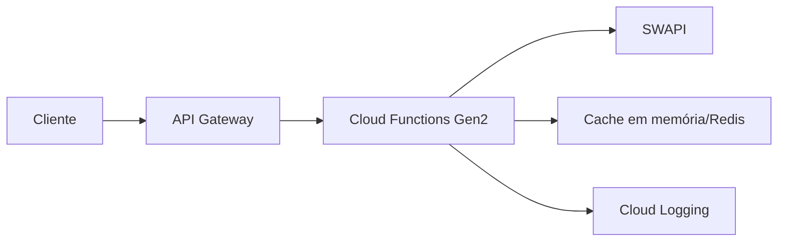

# 🌌 Holonet Galactic Console

       


Uma API para fãs de Star Wars. Conecta recursos da SWAPI e entrega uma experiência rica com filtros, paginação, ordenação, cache, correlações e grafo de relacionamentos. Projetada para rodar no GCP com Cloud Functions + API Gateway.

> **Documentação técnica (para avaliação):** este README + pasta `docs/` (POSTMAN, deploys e checklist).

---

## 🚀 Features
- 🔎 Busca unificada por `people`, `planets`, `starships`, `films`, `species`, `vehicles`
- 🔗 Expansão de dados correlacionados (filmes ↔ personagens)
- 🧭 Grafo leve para visualizações
- 🗺️ Dataset de planetas para mapa interativo
- ⚡ Cache (in-memory ou Redis)
- 🧪 Testes com cobertura 100%
- 🧰 Postman collection pronta

---

## 🧩 Arquitetura (GCP)



**Decisões chave**
- API Gateway: autenticação por API Key, rate limit e roteamento.
- Cloud Functions: escala sob demanda, custo por uso, deploy simples.
- Cache por instância + opcional Redis: reduz chamadas na SWAPI.
- Observabilidade: logs estruturados e correlation-id.

---

## 📦 Estrutura do projeto

```
HOLONET-HUB/
├─ .github/
│  └─ workflows/
│     ├─ ci.yml
│     └─ deploy.yml
├─ src/
│  └─ holonet/
│     ├─ main.py
│     ├─ config.py
│     ├─ deps.py
│     ├─ errors.py
│     ├─ logging.py
│     ├─ routes/
│     ├─ schemas/
│     ├─ services/
│     ├─ clients/
│     └─ utils/
├─ function_entrypoint.py
├─ api/
│  ├─ openapi-gateway.yaml
│  ├─ postman_collection.json
│  ├─ postman_environment_local.json
│  ├─ postman_environment_gateway.json
│  └─ postman_collection_local.json
├─ docs/
│  ├─ POSTMAN.md
│  └─ CLOUD_RUN_GATEWAY.md
├─ infra/
├─ tests/
├─ pyproject.toml
├─ .pre-commit-config.yaml
├─ LICENSE
└─ README.md
```

**Contrato OpenAPI (fonte da verdade)**
- `api/openapi-gateway.yaml` → contrato usado no API Gateway (produção).
- `api/openapi-local.yaml` → referência local para desenvolvimento.
- `api/openapi-gateway.resolved.yaml` → **somente visualização** no Swagger Editor (não usar para deploy).

---

## ✅ Requisitos
- Python 3.11+
- `pip`
- (Opcional) Redis para cache compartilhado
- GCP CLI (`gcloud`) para deploy

---

## 🛠️ Instalação e Setup

### 1) Criar ambiente virtual

```bash
python -m venv .venv
. .venv/bin/activate  # Windows: .venv\Scripts\activate
```

### 2) Instalar dependências

```bash
pip install -r requirements.txt
```

### 3) Rodar local

```bash
uvicorn --app-dir src holonet.main:app --reload --port 8000
```

### 4) Testar rápido

```bash
curl "http://127.0.0.1:8000/health"
```

---

## ⚙️ Variáveis de ambiente

```
SWAPI_BASE_URL=https://swapi.dev/api
CACHE_TTL_SECONDS=180
CACHE_MAX_ENTRIES=2048
CACHE_BACKEND=inmemory
REDIS_URL=
HTTP_TIMEOUT_SECONDS=6
HTTP_RETRIES=2
HTTP_BACKOFF_FACTOR=0.3
API_PAGE_SIZE_DEFAULT=10
MAX_PAGE_SIZE=50
MAX_UPSTREAM_PAGES=6
MAX_EXPAND_CONCURRENCY=8
REQUIRE_API_KEY=false
API_KEY=
```

---

## 🧪 Testes

```bash
pip install -r requirements-dev.txt
pytest -q --cov=holonet --cov-report=term-missing
```

**Windows (se houver conflito com arquivo `.coverage`)**
```powershell
$env:COVERAGE_FILE="$env:TEMP\\holonet_coverage"
pytest -q --cov=holonet --cov-report=term-missing
```

Sem coverage:
```bash
pytest -q --no-cov
```

Paralelo (mais rápido):
```bash
pytest -q --no-cov -n auto
```

---

## 🧹 Lint & Format

```bash
ruff check src tests
ruff format --check src tests
```

---

## 🧷 Pre-commit (bônus)

```bash
pip install pre-commit
pre-commit install
```

---

## 📬 Postman

- Collection: `api/postman_collection.json`
- Collection (local): `api/postman_collection_local.json`
- Local env: `api/postman_environment_local.json`
- Gateway env: `api/postman_environment_gateway.json`

**Como usar**
1. Importar a collection e o environment
2. Selecionar o environment **Holonet Local** ou **Holonet Gateway**
3. Para Gateway, preencher `api_key` e usar apenas rotas `/v1/*`
4. Rodar as requests pelo Runner

Guia completo: `docs/POSTMAN.md`

---

## 🎯 Endpoints (exemplos)

### ✅ Health
```
GET /health
GET /v1/health
GET /v1/meta
```

**Response (exemplo)**
```json
{"status":"ok","source":{"name":"holonet","url":"internal"},"cache":{"hit":false,"ttl":0},"correlation_id":"c6a3b6c2-6c2d-4a86-9c1a-2f4b4e6c9e01"}
```

**Response (exemplo /v1/meta)**
```json
{"name":"Holonet Galactic Console","version":"v1","status":"ok","source":{"name":"holonet","url":"internal"},"cache":{"hit":false,"ttl":0},"correlation_id":"c6a3b6c2-6c2d-4a86-9c1a-2f4b4e6c9e01"}
```

### 🔎 Search
```
GET /v1/search?resource=people&q=luke&page=1&page_size=5&sort=name&order=asc&fields=name,id
```

**Campos de ordenação suportados por recurso**

```
people:   name, height, mass, birth_year, gender, created, edited
planets:  name, population, diameter, climate, terrain, created, edited, rotation_period, orbital_period, surface_water
starships: name, model, manufacturer, cost_in_credits, length, crew, passengers, starship_class, created, edited
films:    title, episode_id, release_date, director, producer, created, edited
species:  name, classification, designation, average_height, average_lifespan, language, created, edited
vehicles: name, model, manufacturer, cost_in_credits, length, crew, passengers, vehicle_class, created, edited
```

**Response (exemplo)**
```json
{
  "items": [
    {"name": "Luke Skywalker", "id": 1}
  ],
  "pagination": {
    "page": 1,
    "page_size": 5,
    "total_items": 82,
    "total_pages": 17,
    "has_next": true,
    "has_prev": false
  },
  "source": {"name": "swapi", "url": "https://swapi.dev/api"},
  "cache": {"hit": false, "ttl": 180},
  "correlation_id": "c6a3b6c2-6c2d-4a86-9c1a-2f4b4e6c9e01"
}
```

### 🎬 Films
```
GET /v1/films/1
```

**Response (exemplo)**
```json
{
  "item": {
    "id": 1,
    "title": "A New Hope",
    "episode_id": 4,
    "release_date": "1977-05-25"
  },
  "source": {"name": "swapi", "url": "https://swapi.dev/api"},
  "cache": {"hit": false, "ttl": 180}
}
```

### 🧑 People / 🪐 Planets / 🚀 Starships
```
GET /v1/people/{id}
GET /v1/planets/{id}
GET /v1/starships/{id}
```

**Response (exemplo: people)**
```json
{
  "item": {
    "id": 1,
    "name": "Luke Skywalker",
    "gender": "male"
  },
  "source": {"name": "swapi", "url": "https://swapi.dev/api"},
  "cache": {"hit": false, "ttl": 180}
}
```

**Response (exemplo: planets)**
```json
{
  "item": {
    "id": 1,
    "name": "Tatooine",
    "climate": "arid",
    "terrain": "desert"
  },
  "source": {"name": "swapi", "url": "https://swapi.dev/api"},
  "cache": {"hit": false, "ttl": 180}
}
```

**Response (exemplo: starships)**
```json
{
  "item": {
    "id": 9,
    "name": "Death Star",
    "starship_class": "Deep Space Mobile Battlestation"
  },
  "source": {"name": "swapi", "url": "https://swapi.dev/api"},
  "cache": {"hit": false, "ttl": 180}
}
```

### 🔗 Correlações
```
GET /v1/films/{id}/characters
GET /v1/people/{id}/films
```

**Response (exemplo: films/{id}/characters)**
```json
{
  "items": [
    {"id": 1, "name": "Luke Skywalker"}
  ],
  "film": {"id": 1, "title": "A New Hope"},
  "source": {"name": "swapi", "url": "https://swapi.dev/api"},
  "cache": {"hit": false, "ttl": 180}
}
```

**Response (exemplo: people/{id}/films)**
```json
{
  "items": [
    {"id": 1, "title": "A New Hope"}
  ],
  "person": {"id": 1, "name": "Luke Skywalker"},
  "source": {"name": "swapi", "url": "https://swapi.dev/api"},
  "cache": {"hit": false, "ttl": 180}
}
```

### 🧠 Graph
```
GET /v1/graph?start_resource=people&start_id=1&depth=2
```

**Response (exemplo)**
```json
{
  "graph": {
    "nodes": [
      {"id": "people:1", "resource": "people", "label": "Luke Skywalker"},
      {"id": "films:1", "resource": "films", "label": "A New Hope"}
    ],
    "edges": [
      {"from": "people:1", "to": "films:1", "type": "films"}
    ]
  },
  "source": {"name": "swapi", "url": "https://swapi.dev/api"},
  "cache": {"hit": false, "ttl": 180}
}
```

### 🗺️ Planets Map
```
GET /v1/planets/map?page_size=10
```

**Response (exemplo)**
```json
{
  "items": [
    {
      "id": 1,
      "name": "Tatooine",
      "terrain": "desert",
      "climate": "arid",
      "population": "200000",
      "category": "arid",
      "meta": {
        "diameter": "10465",
        "gravity": "1 standard",
        "orbital_period": "304",
        "rotation_period": "23"
      }
    }
  ],
  "source": {"name": "swapi", "url": "https://swapi.dev/api"},
  "cache": {"hit": false, "ttl": 180}
}
```

---

## ☁️ Deploy no GCP (Cloud Functions Gen2 + API Gateway)

### Variáveis (preencha apenas esses valores)
```
PROJECT_ID=SEU_PROJETO
REGION=us-central1
FUNCTION_NAME=holonet-api
GATEWAY_API_ID=holonet-api
GATEWAY_CONFIG_ID=holonet-config
GATEWAY_ID=holonet-gateway
```


### 1) Pré-requisitos + APIs (gcloud)

```bash
gcloud auth login
gcloud config set project "$PROJECT_ID"
gcloud services enable \
  cloudfunctions.googleapis.com \
  cloudbuild.googleapis.com \
  artifactregistry.googleapis.com \
  apigateway.googleapis.com \
  serviceusage.googleapis.com \
  iam.googleapis.com

gcloud services list --enabled
```

PowerShell (use o **Google Cloud SDK Shell** ou PowerShell com `gcloud` no PATH):
```powershell
gcloud auth login
gcloud config set project $PROJECT_ID
gcloud services enable `
  cloudfunctions.googleapis.com `
  cloudbuild.googleapis.com `
  artifactregistry.googleapis.com `
  apigateway.googleapis.com `
  serviceusage.googleapis.com `
  iam.googleapis.com

gcloud services list --enabled
```

### 2) Testes locais antes do deploy

```bash
pip install -r requirements.txt
pip install -r requirements-dev.txt
pytest -q
```

### 3) Deploy da Cloud Function (Gen2 HTTP)

Linux/macOS:
```bash
./infra/gcloud/deploy.sh "$PROJECT_ID" "$REGION" "$FUNCTION_NAME"
```

PowerShell:
```powershell
./infra/gcloud/deploy.ps1 -ProjectId "$PROJECT_ID" -Region "$REGION" -FunctionName "$FUNCTION_NAME"
```

Obter a URL da Function:
```bash
gcloud functions describe "$FUNCTION_NAME" --gen2 --region "$REGION" --format="value(serviceConfig.uri)"
```

Smoke tests (Function URL):
```bash
curl "$FUNCTION_URL/health"
curl "$FUNCTION_URL/v1/health"
curl "$FUNCTION_URL/v1/meta"
```

### 4) API Gateway (OpenAPI)

Linux/macOS:
```bash
./infra/gcloud/create_gateway.sh "$PROJECT_ID" "$REGION" "$FUNCTION_NAME" "$GATEWAY_API_ID" "$GATEWAY_CONFIG_ID" "$GATEWAY_ID"
```

PowerShell:
```powershell
./infra/gcloud/create_gateway.ps1 -ProjectId "$PROJECT_ID" -Region "$REGION" -FunctionName "$FUNCTION_NAME" -GatewayApiId "$GATEWAY_API_ID" -GatewayConfigId "$GATEWAY_CONFIG_ID" -GatewayId "$GATEWAY_ID"
```

Pegar o hostname do gateway:
```bash
gcloud api-gateway gateways describe "$GATEWAY_ID" --location "$REGION" --format="value(defaultHostname)"
```

Ativar o **serviço gerenciado** do Gateway (obrigatório para liberar chamadas com API Key):
```bash
gcloud api-gateway apis describe "$GATEWAY_API_ID" --format="value(managedService)"
gcloud services enable "$MANAGED_SERVICE"
```

### 5) API Key (obrigatório)

Criar a key:
```bash
gcloud services api-keys create --display-name="Holonet API Key"
gcloud services api-keys list --format="table(name,displayName)"
gcloud services api-keys get-key-string KEY_ID
```

Restringir a key (Console):
- **APIs & Services > Credentials > API Keys**
- Editar a chave → **API restrictions** → selecionar:
  - **API Gateway API**
  - **Holonet Galactic Console API** (serviço gerenciado do Gateway)

Chamada com key:
```bash
curl "https://$GATEWAY_HOST/v1/search?resource=people&q=luke" -H "x-api-key: $API_KEY"
```

### 6) Rate limiting / Proteção
- **Gateway**: quotas devem ser configuradas em **APIs & Services > Quotas** para o serviço gerenciado do Gateway.
- **App**: limites já aplicados via env (`MAX_PAGE_SIZE`, `MAX_UPSTREAM_PAGES`, `MAX_EXPAND_CONCURRENCY`).

### 7) Observabilidade (logs)
```bash
gcloud logging read 'resource.type="cloud_function" AND resource.labels.function_name="'"$FUNCTION_NAME"'"' --limit 50
```

### 8) Smoke tests (Gateway)
```bash
curl "https://$GATEWAY_HOST/v1/search?resource=people&q=luke" -H "x-api-key: $API_KEY"
curl "https://$GATEWAY_HOST/v1/health" -H "x-api-key: $API_KEY"
curl "https://$GATEWAY_HOST/v1/meta" -H "x-api-key: $API_KEY"
```

**Status (último deploy)**
- Cloud Function Gen2: OK
- API Gateway: OK
- Smoke tests: OK

---

## ✅ CI/CD

**CI (GitHub Actions)**  
Roda em `pull_request` e `push` para `main`:
- `ruff check`
- `ruff format --check`
- `bandit -r src`
- `pip-audit`
- `pytest` + coverage (fail < 70%)

**CD (GitHub Actions – manual)**  
Workflow `deploy.yml` (manual via `workflow_dispatch`) faz:
- deploy da Cloud Function Gen2  
- (opcional) update do API Gateway  
- smoke tests `/v1/health` e `/v1/meta`

**Secrets necessários (GitHub → Settings → Secrets and variables)**  
- `GCP_PROJECT_ID`  
- `GCP_REGION`  
- `GCP_WORKLOAD_ID_PROVIDER` (se usar WIF)  
- `GCP_SERVICE_ACCOUNT_EMAIL` (se usar WIF)  
- `GOOGLE_CREDENTIALS` (alternativa simples com JSON)

Checklist de release: `docs/RELEASE_CHECKLIST.md`

---

## ☁️ Deploy opcional (Cloud Run)

```bash
./infra/gcloud/deploy_cloudrun.sh SEU_PROJETO us-central1 holonet-api
```

Windows:

```powershell
./infra/gcloud/deploy_cloudrun.ps1 -ProjectId "SEU_PROJETO" -Region "us-central1" -ServiceName "holonet-api"
```

Guia detalhado: `docs/CLOUD_RUN_GATEWAY.md`.

---

## 🧱 IaC (Terraform - bonus)

```bash
cd infra/terraform
terraform init
terraform apply -var "project_id=SEU_PROJETO" -var "source_archive_path=../holonet-src.zip"
```

Obs: gere o zip com o codigo (ex: `zip -r holonet-src.zip src function_entrypoint.py requirements.txt`).

Para apontar o API Gateway para Cloud Run:

```bash
terraform apply -var "project_id=SEU_PROJETO" -var "source_archive_path=../holonet-src.zip" -var "backend_url_override=URL_DO_CLOUD_RUN"
```

---

## 📌 Checklist de requisitos
- [x] Python + FastAPI
- [x] Cloud Functions + API Gateway
- [x] SWAPI como fonte
- [x] Endpoints com filtros e correlações
- [x] Paginação e ordenação
- [x] Cache e resiliência (timeouts/retries)
- [x] Logs e correlação
- [x] Testes unitários
- [x] OpenAPI (gateway)
- [x] IaC (bonus)
- [x] CI/CD (GitHub Actions)

---

## 🧭 Trade-offs, observabilidade e melhorias
- **Cloud Run recomendado para FastAPI (ASGI)**: Cloud Functions atende ao requisito do case; para produção, Cloud Run é mais apropriado para ASGI.
- **Cache compartilhado**: usar Memorystore/Redis para consistência entre instâncias.
- **Rate limiting**: aplicar quotas no API Gateway.
- **Observabilidade**: logs estruturados em JSON + `x-correlation-id`; evolução futura para OpenTelemetry.

**Exemplos de logs**
```json
{"event":"request_completed","path":"/v1/search","method":"GET","status":200,"correlation_id":"c6a3b6c2-6c2d-4a86-9c1a-2f4b4e6c9e01","elapsed_ms":42}
```

```json
{"event":"swapi_request","url":"https://swapi.dev/api/people/1/","status":200,"elapsed_ms":183,"correlation_id":"c6a3b6c2-6c2d-4a86-9c1a-2f4b4e6c9e01"}
```

```json
{"event":"swapi_cache_hit","url":"https://swapi.dev/api/people/1/","correlation_id":"c6a3b6c2-6c2d-4a86-9c1a-2f4b4e6c9e01"}
```

**Dockerfile (por que existe?)**
- Padroniza execução local/CI.
- Facilita migração futura para Cloud Run sem refatoração.

---

## 🧯 Troubleshooting

**Porta em uso**
```
uvicorn --app-dir src holonet.main:app --reload --port 8001
```

**ModuleNotFoundError: No module named 'holonet'**
```
uvicorn --app-dir src holonet.main:app --reload --port 8000
```

**401 Unauthorized**
- Verifique `REQUIRE_API_KEY` e `API_KEY`.
- No Postman, preencha `api_key` no environment.

**SWAPI indisponivel / 502**
- A SWAPI pode estar instável; tente novamente.
- Ajuste `HTTP_TIMEOUT_SECONDS` e `HTTP_RETRIES` se necessário.

**PERMISSION_DENIED (API Gateway)**
- Verifique se o **serviço gerenciado** do Gateway foi habilitado no projeto:
  - `gcloud api-gateway apis describe "$GATEWAY_API_ID" --format="value(managedService)"`
  - `gcloud services enable "$MANAGED_SERVICE"`
- Confirme se a API Key está restrita para **API Gateway API** e **Holonet Galactic Console API**.

**Mensagem sobre tag de ambiente do projeto**
- Alguns projetos novos exigem tag `environment` (Production/Development/Test/Staging).
- Siga o link do erro ou ignore se o deploy continuar funcionando.

---

## 👤 Autor
**Matheus Dutra**  
Holonet Engineer · Jedi of APIs

## 📄 Licença
Distribuído sob a **MIT License**.


