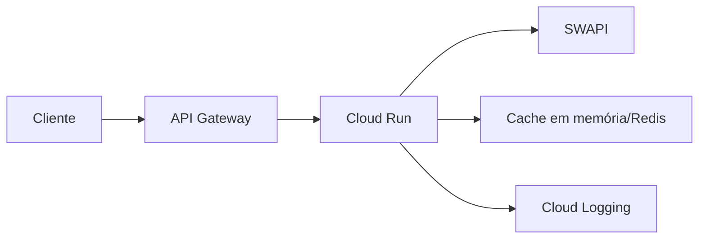

# Deploy Cloud Run + API Gateway

Este guia usa Cloud Run (ASGI nativo) com API Gateway para autenticação e rate limit.



## 1) Deploy no Cloud Run

Requisitos: `gcloud` configurado.

```bash
./infra/gcloud/deploy_cloudrun.sh SEU_PROJETO us-central1 holonet-api
```

Windows:

```powershell
./infra/gcloud/deploy_cloudrun.ps1 -ProjectId "SEU_PROJETO" -Region "us-central1" -ServiceName "holonet-api"
```

Anote a URL do Cloud Run (ex.: `https://holonet-api-xxxxx-uc.a.run.app`).

## 2) API Gateway apontando para Cloud Run

### Via Terraform

```bash
cd infra/terraform
terraform init
terraform apply -var "project_id=SEU_PROJETO" -var "source_archive_path=../holonet-src.zip" -var "backend_url_override=URL_DO_CLOUD_RUN"
```

### Via Console

- Crie um API Gateway.
- Importe `api/openapi-gateway.yaml`.
- Substitua manualmente o backend pela URL do Cloud Run.

## 2.1) IAM entre API Gateway e Cloud Run (recomendado)

1) Remova acesso público:
```bash
gcloud run services remove-iam-policy-binding holonet-api \
  --region us-central1 \
  --member="allUsers" \
  --role="roles/run.invoker"
```

2) Conceda acesso ao API Gateway:
```bash
PROJECT_NUMBER=$(gcloud projects describe SEU_PROJETO --format="value(projectNumber)")
gcloud run services add-iam-policy-binding holonet-api \
  --region us-central1 \
  --member="serviceAccount:service-$PROJECT_NUMBER@gcp-sa-apigateway.iam.gserviceaccount.com" \
  --role="roles/run.invoker"
```

3) No OpenAPI, adicione `jwt_audience` igual à URL do Cloud Run:
```yaml
x-google-backend:
  address: https://SEU-CLOUD-RUN
  jwt_audience: https://SEU-CLOUD-RUN
  path_translation: APPEND_PATH_TO_ADDRESS
```

## 3) API Key

- Habilite API Key no API Gateway.
- Crie a chave e associe a um projeto.
- Envie a chave no header: `x-api-key`.

## 4) Teste rápido

```bash
curl -H "x-api-key: SUA_API_KEY" "https://SEU_GATEWAY/v1/search?resource=people&q=luke"
```


